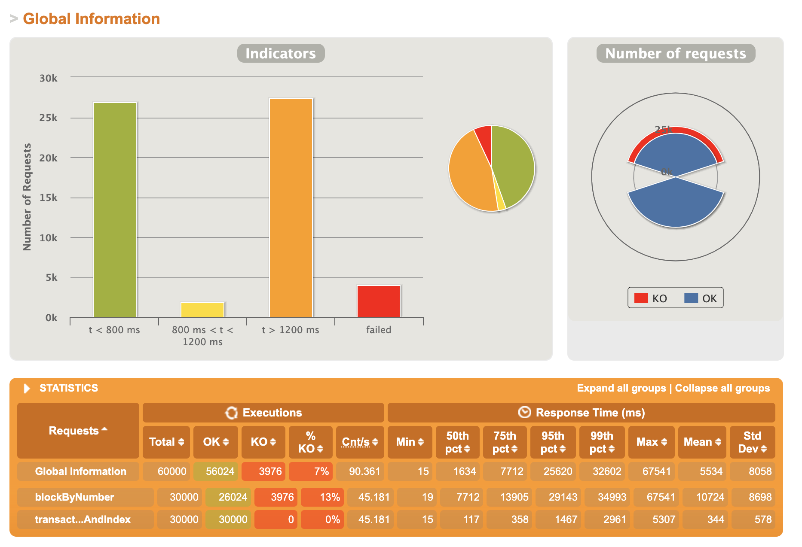
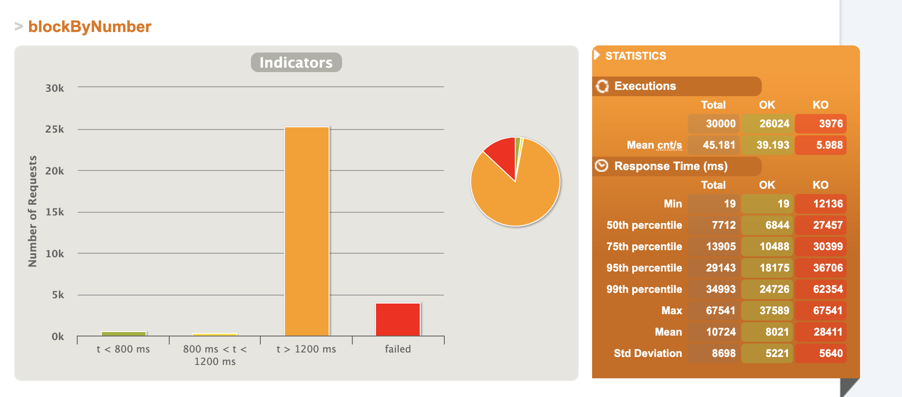
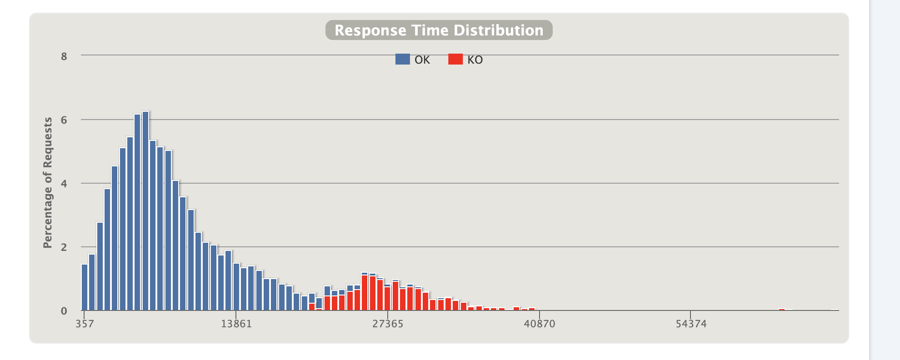
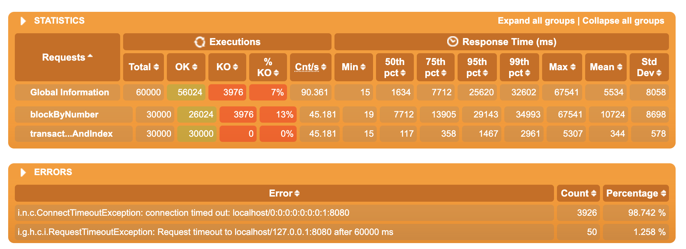

# Load Testing

# Setup
Since I was running these simulations on my local machine, per Gatling instructions, I increased the open file limit from 2560 to 65536.
Run `ulimit -n 65536` to increase the limit in the current shell. This allows many new sockets to be opened and achieve heavy load.
I also enabled `sharedConnections` setting within each Gatling simulation as well as updated my /etc/sysctl.conf according to [Kernal and Network Tuning](https://gatling.io/docs/gatling/reference/current/general/operations/)

I utilized https://www.rinkeby.io/#explorer to figure out a range of block numbers that exist in Rinkleby network that I could randomly inject as request parameters.
In a future iteration, I would make this process automated by writing a function that would be able to parse and gather a list of block numbers on the given network. Either an async on online process before the test simulations. Could utilize method `eth_getLogs`, libraries like ethscan, etc.

# Hypothesis
Upper bounds for test:
- 1 service instance
- 1 machine running the load tests(3.1 GHz Dual-Core Intel Core i5)
- Potential for rate limiting by Infura API

Future improvements:
- Run service on container registry such as ECS with ability to scale up or down number of nodes as well as have ability to vertically scale CPU or memory utilization.
- Run using load test tool backed by cluster of nodes so that more load can be thrown at the service that is more realistic to what Infura API sees on a daily basis.
- Before simulations start, have automated process that utilizes something like ethscan or scrapes the Ethereum network blockchain to gather a large list of blockNumbers that have transactions to generate more realistic load tests.

# Scenarios
### Test Scenario 1: Performance comparison / Stress Test
Run same test scenario (same # of users and expected RPS) against both eth methods to compare how they perform 1:1 under stress. Lots of users, the small amount of time. Instead of injecting users all at once, going to inject high amount of users over a short period of time (1 minute) to still have a stress test scenario, but within bounds of processor limitations.

Test Duration: 90 seconds
- 1 virtual user => executes 2 requests.
- 250 VU overall * 2 requests = 500 requests in total
- Target: 500 RPS over 1 minute. 
- Throttling tries to ensure a targeted throughput with the given scenario and its injection profile (number of users and duration). It’s a bottleneck, ie an upper limit.

### Test Scenario 2: Performance comparison / Soak Test
Run same test scenario against both eth methods to compare how they perform 1:1 over a longer period of time with slower ramp up in traffic.

Test Duration: 10 minutes
Per endpoint:
- 20 users injected per second for 60* 5 minutes = 300 seconds
- 20 users * 300 seconds = 6000 users overall each executing 5 requests - 30000 requests executed overall

# Results
### Test Scenario 1
Thing to consider:
- Expected vs. actual throughput in requests per second
- Peak throughput (What is the most traffic that you get over a certain period?)

| Method                           | iteration # | changes from last test | expected RPS | actual RPS on average | Total Requests | Response Time | Response metrics                                                 |
|----------------------------------|-------------|------------------------|--------------|----------|----------------|---------------|------------------------------------------------------------------|
| blockByNumber                    | 1           | N/a                    | 8.3 RPS       | 18.5 RPS   | 500 R          | see img       | T < 800 ms: 43% requests 1200 < T < 800 ms: 4% T > 1200 ms : 53% |
| transactionByBlockNumberAndIndex | 1           | N/a                    | 8.3 RPS       | 18.5 RPS   | 500 R          | see img       | T < 800 ms: 10% requests 1200 < T < 800 ms: 5% T > 1200 ms : 85% |

Analysis:
- Both endpoints had similar average overall response times (2749 ms vs. 2886 ms). 
- Both endpoints were able to hit the expected throughput with no KO errors (with a quick note that the throughput is lower than realistic traffic)
- transactionByBlockNumberAndIndex had better tail end latency. 
- p95 or 95% percent of requests against transactionByBlockNumberAndIndex processed slightly faster although nothing conclusive in 5679 ms compared to 7878 ms for blockByIndex
- Service itself can handle modest load (500 RPM) with 100% success rate
- Not enough data to draw meaningful conclusions though. Would want to run a plethora of iterations in order to make a meaningful conclusion.
- Faced rate limiting:
  - 15:55:10.574 [pool-8-thread-653] DEBUG org.web3j.protocol.http.HttpService - {"jsonrpc":"2.0","id":69161,"error":{"code":-32005,"message":"daily request count exceeded, request rate limited","data":{"rate":{"allowed_rps":1,"backoff_seconds":30,"current_rps":105.66666666666667},"see":"https://infura.io/dashboard"}}}

### Test Scenario 2

Service Level Metrics overall:

| Method                           | iteration # | changes from last test | expected # Requests | actual # Requests (ok / ko) | Peak RPS | Mean RPS | Response Time |
|----------------------------------|-------------|------------------------|---------------------|-----------------------------|----------|----------|---------------|
| blockByNumber                    | 1           | N/a                    | 30000 RPS           | 26024 / 3976 (13% KO)       | 444 RPS  |   45.181 | see img       |
| transactionByBlockNumberAndIndex | 1           | N/a                    | 30000 RPS           | 30000 / 0 (0% KO)           | 181 RPS  |   45.181 | see img       |

Analysis:
- Apologizes this is only 1 iteration - more time I would have run more iterations and a higher daily limit.
- Service struggled to handle burst of connections likely could be tuned by setting the connection timeout to be lower and the request timeout to be higher to deal with longer processing times.
- Having multiple server instances should help this as well.
- Interesting that /blockByNumber had 13% KO requests, while /transactionByBlockNumberAndIndex had none. Would need to dig more into it to see why.