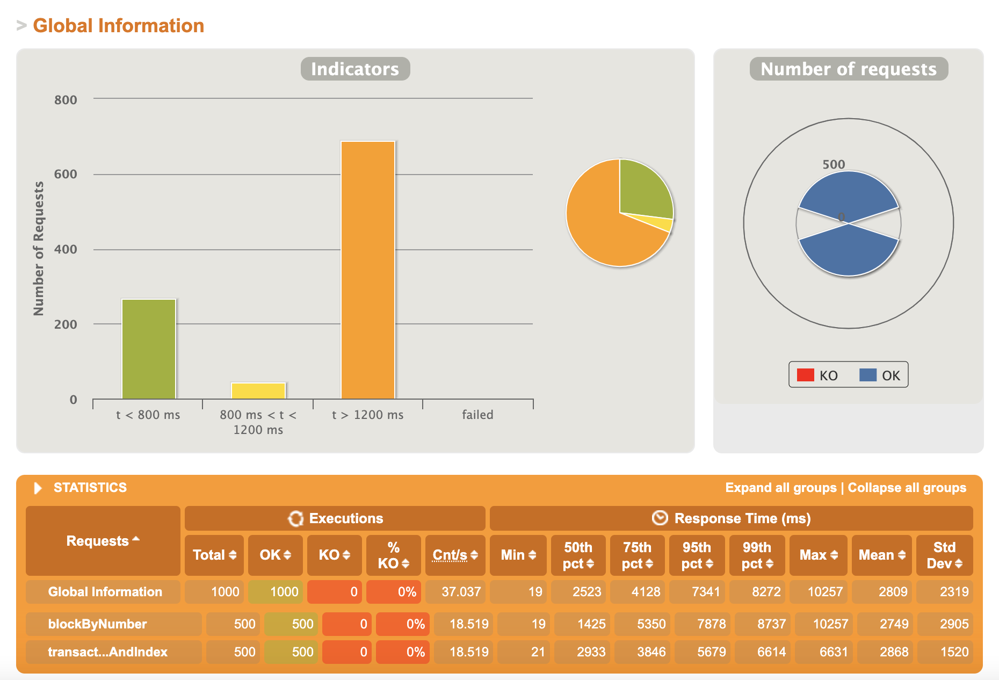
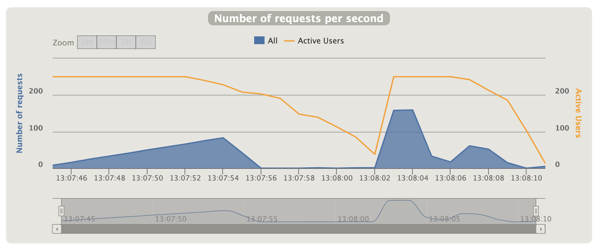
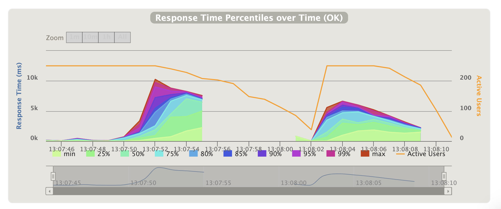
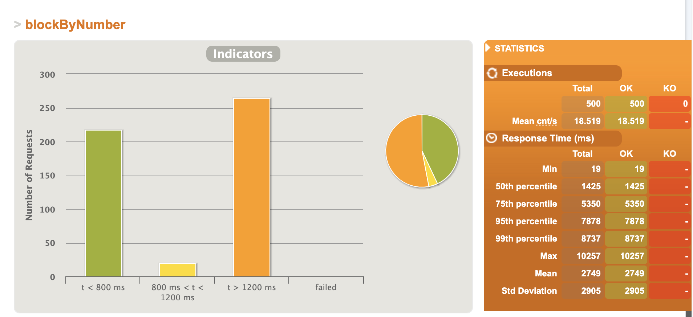
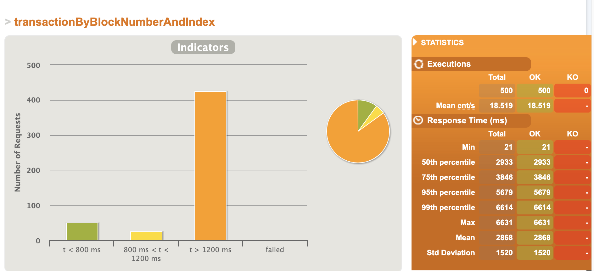

# Load Testing

# Setup
Since I was running these simulations on my local machine, per Gatling instructions, I increased the open file limit from 2560 to 65536.
Run `ulimit -n 65536` to increase the limit in the current shell. This allows many new sockets to be opened and achieve heavy load.
I also enabled `sharedConnections` setting within each Gatling simulation as well as updated my /etc/sysctl.conf according to [Kernal and Network Tuning](https://gatling.io/docs/gatling/reference/current/general/operations/)

I utilized https://www.rinkeby.io/#explorer to figure out a range of block numbers that exist in Rinkleby network that I could randomly inject as request parameters.
In a future iteration, I would make this process automated by writing a function that would be able to parse and gather a list of block numbers on the given network. Either an async on online process before the test simulations. Could utilize method `eth_getLogs`, libraries like ethscan, etc.

# Scenarios
Test Scenario Iteration 1: Performance comparison / Stress Test
Run same test scenario (same # of users and expected RPS) against both eth methods to compare how they perform 1 to 1. Lots of users, the small amount of time. Instead of injecting users all at once, going to inject high amount of users over a short period of time (1 minute) to still have a stress test scenario, but within bounds of processor limitations.

- 1 virtual user => executes 5 requests.
- 1000 VU overall * 5 requests = 5,000 requests overall / 60 seconds = 84 RPS approx
- Expected load: 84 RPS

Test Scenario Iteration 2: Performance comparison / Soak Test
Run same test scenario against both eth methods to compare how they perform 1 to 1 over a longer period of time with more consistent spikes in traffic.

- 1 virtual user => executes 5 requests.
- 1000 VU overall * 5 requests = 5,000 requests overall / 60 seconds = 84 RPS approx
- Expected load: 84 RPS

# Hypothesis
Upper bounds for test:
- 1 service instance
- 1 machine running the load tests(3.1 GHz Dual-Core Intel Core i5)
- Potential for rate limiting by Infura API

Future improvements:
- Run service on container registry such as ECS with ability to scale up or down number of nodes as well as have ability to vertically scale CPU or memory utilization.
- Run using load test tool backed by cluster of nodes so that more load can be thrown at the service that is more realistic to what Infura API sees on a daily basis.
- Before simulations start, have automated process that utilizes something like ethscan or scrapes the Ethereum network blockchain to gather a large list of blockNumbers that have transactions to generate more realistic load tests.

# Results
Thing to consider:
- Expected vs. actual throughput in requests per second
- Peak throughput (What is the most traffic that you get over a certain period?)

| Method                           | iteration # | changes from last test | expected RPS | Peak RPS | Total Requests | Response Time | Response metrics                                                 |
|----------------------------------|-------------|------------------------|--------------|----------|----------------|---------------|------------------------------------------------------------------|
| blockByNumber                    | 1           | N/a                    | 84 RPS       | 83 RPS   | 500 R          | see img       | T < 800 ms: 43% requests 1200 < T < 800 ms: 4% T > 1200 ms : 53% |
| transactionByBlockNumberAndIndex | 1           | N/a                    | 84 RPS       | 83 RPS   | 500 R          | see img       | T < 800 ms: 10% requests 1200 < T < 800 ms: 5% T > 1200 ms : 85% |

Method Analysis:
- blockByNumber had better overall response times. Theories - could be due to service perofrmanc

